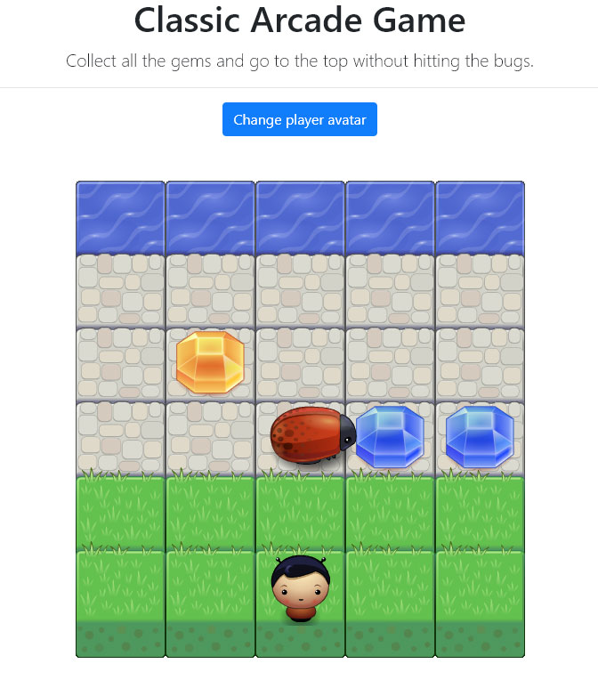
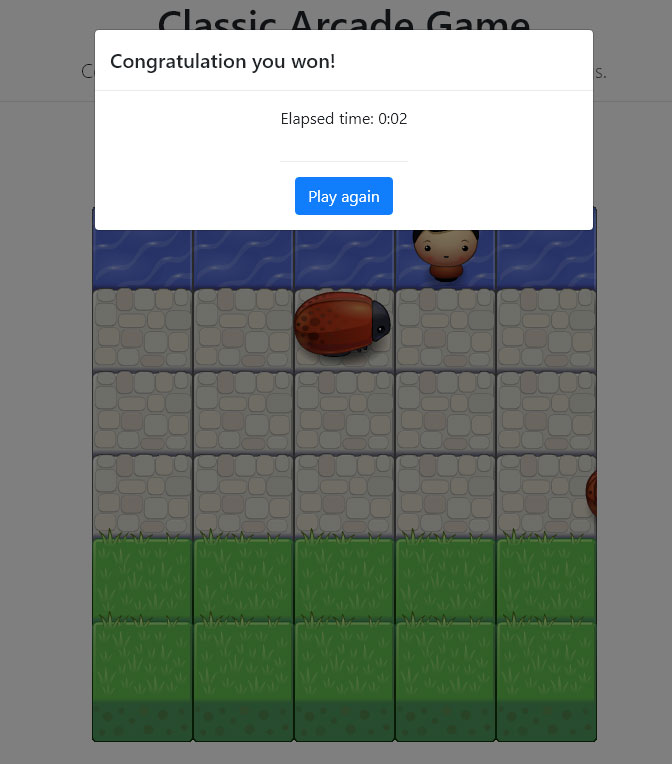

# Classic Arcade Game

## Table of Contents

* [Description](#Description)
* [Instructions](#instructions)
* [Contributing](#contributing)

### Description

- Classic Arcade Game where you need to move the player to using your keyboard arrows and collect all the gems.

### Instructions

- You can customize the game settings from this file `js/app.js`.
- Run the game from `index.html` file.

## Project details

- Styling the project design from this file `css/style.css`.
- The game is using bootstrap and jQuery.

### Contributing

No contribution needed for this project. Therefore, we most likely will not accept pull requests.

For details, check out [CONTRIBUTING.md](CONTRIBUTING.md).
